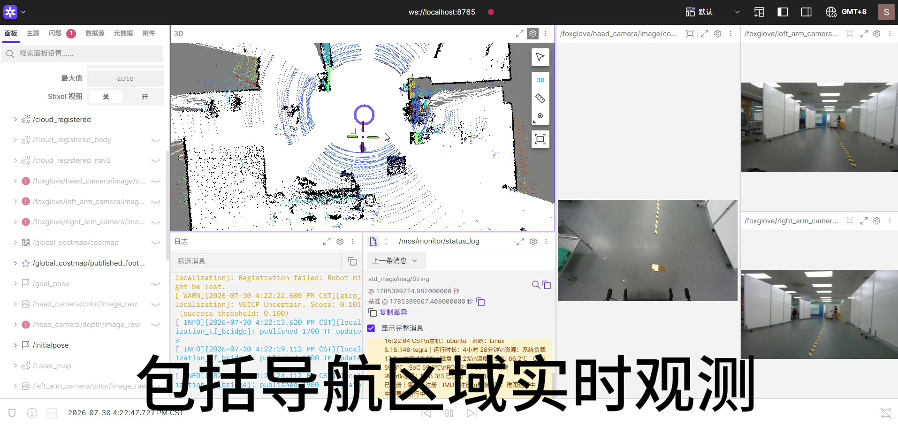

# 机器人远程运维与多机可视化监控

通过 SSH 把机器人 ROS 2 数据接入 Foxglove，集中查看三路相机、地图、点云、导航与资源状态，并提供受管组件启停和显式底盘遥控入口。仓库保存 2026-09-13 本地源码快照、ROS 工作空间和依赖，供代码审阅、维护与迁移。



[观看约 35 秒原速演示视频（Release）](https://github.com/lsclsc2026/u_robot_foxglove_ops/releases/tag/v0.1.0-review)。视频由用户提供，画面日期为 2026-07-30，保留原字幕和音轨；它展示历史操作界面，不代表本仓库代码已完成实机验收。当前未提供可导入的 Foxglove 布局 JSON。

## 能做什么

- 在 WSL/Linux 上通过一条 SSH 连接启动受管组件，并转发 Foxglove Bridge。
- 为头部、左臂、右臂图像生成限帧、缩放的 JPEG 话题；仅保留最新待处理帧。
- 发布资源摘要与结构化诊断；在同一界面查看地图、TF、点云和导航轨迹。
- 用独立进程组管理组件，复用已有进程，并支持多台机器人分配不同本地端口。
- 显式进入遥控模式，通过 `mos_ops_control` 门控速度指令，并暂停/恢复检测到的既有运动进程组。

普通启动也会补启动视觉和导航；它不只是建立只读连接。只想查看已运行 Bridge 时，请使用[纯隧道连接](docs/usage.md#仅连接已有-bridge)。遥控的行为和限制见[使用说明](docs/usage.md#显式遥控模式)。

## 从哪里开始

| 目标 | 文档 |
|---|---|
| 理解客户端、宿主机、容器与 ROS 的关系 | [架构与组件](docs/architecture.md) |
| 在已有厂商环境中部署 | [安装与依赖](docs/installation.md) |
| 修改地址、端口、ROS Domain 与图像参数 | [配置说明](docs/configuration.md) |
| 单机、多机、停止、面板与遥控 | [使用说明](docs/usage.md) |
| 连接失败、无图像、空地图、进程与日志问题 | [排障](docs/troubleshooting.md) |
| 判断快照范围、版本差异与未包含资产 | [范围与限制](docs/scope-and-limitations.md) |
| 追溯源码、权重及发布整理 | [来源清单](docs/provenance.md)、[第三方说明](THIRD_PARTY.md) |

## 目录

```text
code/mos_fleet_monitor/   客户端、宿主机/容器入口、监控脚本、遥控扩展与安装器
code/mos_all_test_ws/     ROS 源码、导航依赖、配置与模型权重
reference/               历史实现、迁移记录与部署参考，不能作为当前安装入口
docs/                    本次整理的中文文档、来源清单与演示封面
```

`code/` 的业务代码、参数默认值与依赖布局保持来源内容。原有 README 和 dated docs 保留用于溯源，已加历史说明；当前阅读以本 README 和 `docs/` 为入口。

## 已部署设备的快速连接

先按[配置说明](docs/configuration.md)核对目标地址、用户名与路径。以下 `robot.example` 是需替换的占位符；执行启动前应确认现场允许启动视觉与导航：

```bash
cd code/mos_fleet_monitor
./client/start-robot-monitor.sh robot.example 8765
```

Foxglove 连接 `ws://localhost:8765`。按 Ctrl+C 仅关闭本地隧道，机器人组件继续运行。停止受管组件：

```bash
./client/stop-robot-monitor.sh robot.example
```

新机器先读安装文档：仓库不包含厂商 Docker 镜像、SDK、全部外部地图或可直接运行的 `install/`。发布整理没有执行编译、功能测试或机器人操作，也未确认实际部署版本。

## 许可

本仓库没有新增整体开源许可。保留各来源文件及第三方声明；部分 ROS 包标注 `Proprietary`，部分声明尚不完整。权限与第三方范围见 [THIRD_PARTY.md](THIRD_PARTY.md)。
