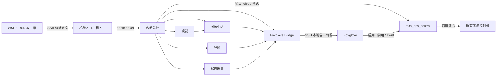

# 架构与组件

## 数据和控制路径

客户端调用宿主机 `/home/lumos/mos_fleet_monitor/bin/`，宿主机进入 `lumos_dev`，容器入口在 `/root/work_space/mos_fleet_monitor/bin/`。ROS 工作空间固定使用 `/tmp/mos_all_test_ws`。宿主机路径与容器路径不是同一目录；Docker 挂载和网络须按现场环境确定。

## 组件职责

| 位置（相对 `code/mos_fleet_monitor`） | 职责 |
|---|---|
| `client/` | 单机、多机连接与停止；SSH master 复用；生成 Foxglove 链接 |
| `host/bin/` | 检查并按需启动容器，转交容器命令 |
| `container/bin/_common.sh` | 默认组件集合、PID/命令归属、进程扫描、总控 flock 与事件记录 |
| `container/bin/mos-monitor-start` | 复用受管及外部进程，只补启动缺失组件 |
| `container/bin/_supervise_component.sh` | 独立进程组、组件 stdout/stderr、退出与 Vision 重试 |
| `container/bin/_run_component.zsh` | ROS 和 SDK 环境、真实命令、相机运行配置与 Bridge 话题白名单 |
| `container/bin/mos-monitor-stop` | 对登记的受管进程组逐级发送 INT、TERM、KILL 并复核 |
| `container/assets/foxglove_image_relay.py` | RGB 最新帧队列、JPEG 编码、限频和过期帧丢弃 |
| `container/assets/mos_status_logger.py` | 系统资源、ROS 图与图像统计，发布摘要和 DiagnosticArray |
| `ops_extension/mos_ops_control/` | 遥控门控、限速、watchdog、运动源进程组暂停与恢复 |
| `optional_vision_guard/`、`optional_nav_guard/` | launch 包装与单实例保护；导航还包装 setup 入口 |

普通组件集合是 vision、navigation、image_relay、status_logger、bridge。teleop 集合在此基础上添加 teleop；因此当前遥控启动入口也包含导航启动步骤，不能根据旧说明推断它不会补启动导航。遥控节点本身不创建额外导航栈。

## 运行时与生命周期

默认运行目录为 `/run/mos_fleet_monitor`，总控锁为 `/run/lock/mos_fleet_monitor.lock`。状态命令主要依靠进程、端口和登记信息，不能证明传感器正常或定位收敛。

普通组件退出后记录事件，其他组件继续运行。Vision 延迟 10 秒重试，短时连续失败 3 次后放弃，运行超过 60 秒重置计数。希望停止 Vision 时应通过受管停止入口处理，单杀子进程可能触发恢复。

停止总控按受管进程组执行 INT → 等待约 6 秒 → TERM → 等待约 4 秒 → KILL；未登记外部进程通常保留。遥控例外：显式启用会对匹配到的已有运动进程组发送 SIGSTOP，禁用时恢复自己暂停的组。

总控 flock 仅串行化总控入口；当前 Vision 直接 `ros2 run`，绕过可选 launch 包装器。源码 launch 的文件锁与可选目录锁也不是同一种锁，所以不能宣称所有手动和集成入口已实现统一互斥。

## ROS 工作空间

`code/mos_all_test_ws/src/` 包含视觉、车筐满载、抓取选择、抓取流水线、机械臂/底盘控制、协调器、路线管理、`lumos_nav` 和完整 `navigation2` 快照。它们用于保存业务依赖和部署上下文；监控安装器只新增编译 `mos_ops_control`，不会替用户全量重建这些包。
